# AWS LangChain Architecture - Complete System Design

## System Architecture Overview

```mermaid
graph TB
    User["👤 User/Client"]
    Internet["🌐 Internet"]
    
    subgraph AWS["AWS Cloud (us-east-1)"]
        subgraph Network["VPC (10.0.0.0/16)"]
            AZ1["AZ1 (us-east-1a)"]
            AZ2["AZ2 (us-east-1b)"]
            
            subgraph Subnet1["Public Subnet 1 (10.0.1.0/24)"]
                Task1["ECS Task 1<br/>Flask App"]
            end
            
            subgraph Subnet2["Public Subnet 2 (10.0.2.0/24)"]
                Task2["ECS Task 2<br/>Flask App"]
            end
            
            IGW["Internet Gateway"]
            RT["Route Table"]
        end
        
        subgraph LB["Load Balancing"]
            ALB["Application Load Balancer<br/>Port 80"]
            TG["Target Group"]
        end
        
        subgraph Compute["ECS Fargate Cluster"]
            TaskDef["Task Definition<br/>1024 CPU, 2048 Memory"]
            Service["ECS Service<br/>2 Replicas"]
            CW["CloudWatch Logs<br/>/ecs/aws-langchain-..."]
        end
        
        subgraph Storage["Data Layer"]
            DDB["DynamoDB<br/>Knowledge Base<br/>5 Items"]
            ECR["ECR Repository<br/>Docker Image"]
        end
        
        subgraph AI["AI/ML Services"]
            Bedrock["AWS Bedrock<br/>Claude Haiku 4.5"]
            Profile["Inference Profile<br/>us.anthropic.claude-haiku-4-5"]
        end
        
        subgraph External["External Services"]
            SerpAPI["SerpAPI<br/>Web Search<br/>Optional"]
        end
    end
    
    User -->|HTTP Request| Internet
    Internet -->|Port 80| ALB
    ALB -->|Route| TG
    TG -->|Target| Task1
    TG -->|Target| Task2
    Task1 -->|Pull Image| ECR
    Task2 -->|Pull Image| ECR
    Task1 -->|Query| DDB
    Task2 -->|Query| DDB
    Task1 -->|Logs| CW
    Task2 -->|Logs| CW
    Task1 -->|Invoke| Bedrock
    Task2 -->|Invoke| Bedrock
    Bedrock -->|Use| Profile
    Task1 -.->|Optional| SerpAPI
    Task2 -.->|Optional| SerpAPI
    Task1 -->|HTTP Response| Internet
    Task2 -->|HTTP Response| Internet
    Internet -->|HTTP Response| User
```

## Request Flow - Complete Journey

## Flask Application Flow - Internal Processing

## AWS Component Interactions

### 1. VPC & Networking

### 2. Load Balancing & Service Discovery

### 3. ECS Fargate Compute Layer

### 4. Data & Storage Layer

### 5. AI/ML & Bedrock Integration

## Detailed Application Flow in Fargate

## Error Handling & Retry Logic

```mermaid
graph TD
    Call["Bedrock Call<br/>invoke_model()"]
    
    Call -->|Try 1| Attempt1["Attempt 1<br/>Wait 1-2s"]
    
    Attempt1 -->|Success| Return["✅ Return Response"]
    Attempt1 -->|Exception| Check1{Is<br/>Exception?}
    
    Check1 -->|Yes| Wait1["Wait exponential<br/>min=1s, max=10s"]
    Check1 -->|No| Return
    
    Wait1 --> Attempt2["Attempt 2<br/>Wait 2-4s"]
    
    Attempt2 -->|Success| Return
    Attempt2 -->|Exception| Check2{Is<br/>Exception?}
    
    Check2 -->|Yes| Wait2["Wait exponential<br/>min=1s, max=10s"]
    Check2 -->|No| Return
    
    Wait2 --> Attempt3["Attempt 3<br/>Wait 4-8s"]
    
    Attempt3 -->|Success| Return
    Attempt3 -->|Exception| Check3{Is<br/>Exception?}
    
    Check3 -->|Yes| Fail["❌ Raise RetryError<br/>Extract last exception"]
    Check3 -->|No| Return
    
    Fail -->|Extract| FinalError["Extract inner<br/>exception details<br/>from RetryError"]
    
    FinalError -->|Return| ErrorMsg["Return error message<br/>BEDROCK_ERROR:<br/>ValidationException:<br/>..."]
    
    Return -->|User| Success["User gets<br/>summary"]
    ErrorMsg -->|User| Error["User gets<br/>error in summary field"]
```

## Infrastructure as Code (IaC) Organization

## Deployment Sequence

## Key Metrics & Thresholds

| Component | Metric | Threshold | Action |
|-----------|--------|-----------|--------|
| ALB | Health Check | 200 OK | Target marked Healthy |
| ALB | Health Check Interval | 30s | Every 30 seconds |
| ALB | Unhealthy Threshold | 2 failed checks | Remove from targets |
| ECS Task | CPU | 1024 units (1 vCPU) | Autoscale if exceeded |
| ECS Task | Memory | 2048 MB | Hard limit, OOM if exceeded |
| ECS Service | Desired Count | 2 | Maintain 2 running tasks |
| Bedrock | Retry Attempts | 3 | Maximum retry attempts |
| Bedrock | Backoff | Exponential (1-10s) | Wait between retries |
| DynamoDB | Billing | PAY_PER_REQUEST | Auto-scale read/write |
| CloudWatch | Log Retention | Indefinite | Keep all logs |

---

## Conclusion

This architecture provides:
- ✅ **High Availability**: 2 tasks across 2 AZs
- ✅ **Scalability**: Fargate auto-scaling capability
- ✅ **Reliability**: Health checks, retry logic, error handling
- ✅ **Cost Efficiency**: On-demand pricing for all services
- ✅ **Observability**: CloudWatch Logs integration
- ✅ **AI/ML Integration**: AWS Bedrock with latest Claude Haiku
- ✅ **Infrastructure as Code**: Full OpenTofu management
